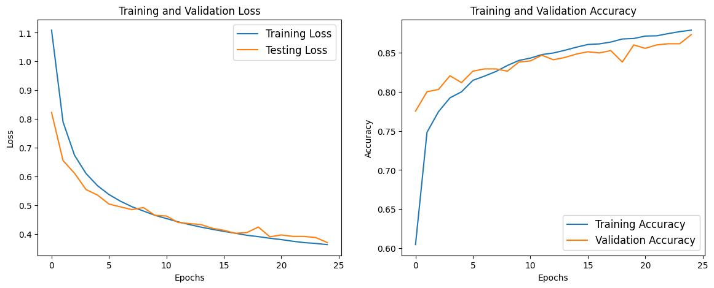
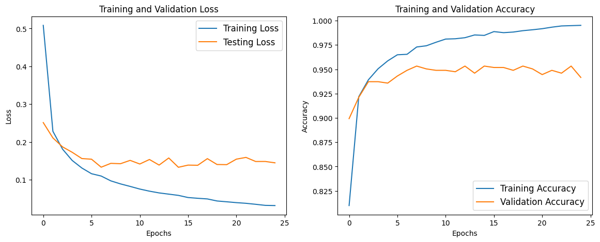

# Chicken Disease Classification

## Latar Belakang dan Tujuan Pengembangan

Penyakit pada ayam seperti **Coccidiosis**, **Salmonella**, dan **Newcastle Disease (NCD)** merupakan ancaman utama terhadap kesehatan ayam, yang berdampak pada produktivitas peternakan. Mendiagnosis penyakit ini melalui pemeriksaan feses dapat menjadi solusi praktis dan efisien. 

Aplikasi ini dirancang untuk membantu peternak atau praktisi kesehatan hewan dalam mendeteksi penyakit ayam menggunakan teknologi pembelajaran mesin berbasis citra. Dengan mengunggah gambar feses ayam, aplikasi akan mengidentifikasi kondisi kesehatan ayam dan memberikan hasil diagnosis beserta tingkat kepercayaannya. 

Tujuan pengembangan aplikasi ini adalah:
- Memberikan solusi cepat dan praktis untuk diagnosis awal penyakit ayam.
- Membantu meningkatkan efisiensi di bidang peternakan melalui integrasi teknologi AI.
- Meningkatkan tingkat kesehatan ayam dengan deteksi dini.

---

## Langkah Instalasi

Ikuti langkah-langkah berikut untuk menginstal dependencies dan menjalankan aplikasi web:

### Prasyarat
- Python 3.10 atau lebih baru
- Virtual environment (opsional tetapi direkomendasikan)

### 1. Clone Repository
Clone repository ini ke komputer Anda:
```bash
git clone https://github.com/username/BreadcrumbsChickenDiseaseClassification.git
cd BreadcrumbsChickenDiseaseClassification
```

### 2. Buat dan Aktifkan Virtual Environment (Opsional)

**Linux/MacOS:**
```bash
python3 -m venv venv
source venv/bin/activate
```

**Windows:**
```bash
python -m venv venv
venv\Scripts\activate
```

### 3. Instal Dependencies
Instal semua dependencies yang dibutuhkan menggunakan pip:
```bash
pip install -r requirements.txt
```

### 4. Jalankan Aplikasi
Jalankan aplikasi web menggunakan Streamlit:
```bash
streamlit run app.py
```
Aplikasi akan berjalan di browser web Anda di alamat default: `http://localhost:8501`

---

## Deskripsi Model

### Model 1: **VGG16**
Model VGG16 adalah model deep learning berbasis convolutional neural network (CNN) dengan arsitektur yang dalam dan terstruktur. Model ini digunakan karena kemampuannya dalam menangkap fitur visual secara hierarkis.

- **Ukuran Input**: (128, 128, 3)
- **Jumlah Layer**: 16 convolutional layers
- **Kelebihan**:
  - Sangat baik untuk dataset dengan fitur yang kompleks.
  - Pre-trained pada ImageNet, sehingga mempersingkat waktu pelatihan.
- **Kekurangan**:
  - Ukuran model relatif besar.
  - Membutuhkan waktu inferensi yang lebih lama dibandingkan MobileNetV2.

### Model 2: **MobileNetV2**
Model MobileNetV2 adalah arsitektur CNN yang ringan dan efisien, dirancang untuk perangkat dengan sumber daya terbatas. 

- **Ukuran Input**: (128, 128, 3)
- **Kelebihan**:
  - Ringan dan cepat.
  - Memiliki performa yang kompetitif pada dataset gambar kecil.
  - Cocok untuk aplikasi berbasis web.
- **Kekurangan**:
  - Performa mungkin lebih rendah dibanding model berat seperti VGG16 pada dataset kompleks.

---

## Hasil dan Analisis Perbandingan Model

### Grafik dan Tabel Metrik Evaluasi
Berikut adalah hasil perbandingan kinerja model menggunakan metrik **Akurasi**, **Presisi**, **Recall**, dan **F1-Score** pada dataset validasi:

#### MobileNetV2
| Kelas        | Precision | Recall | F1-Score | Support |
|--------------|-----------|--------|----------|---------|
| Coccidiosis  | 0.93      | 0.89   | 0.91     | 205     |
| Healthy      | 0.89      | 0.94   | 0.92     | 227     |
| NCD          | 0.50      | 0.50   | 0.50     | 40      |
| Salmonella   | 0.87      | 0.85   | 0.86     | 213     |
| **Rata-rata**| **0.87**  | **0.87**| **0.87** | 685     |

#### VGG16
| Kelas        | Precision | Recall | F1-Score | Support |
|--------------|-----------|--------|----------|---------|
| Coccidiosis  | 0.96      | 0.98   | 0.97     | 205     |
| Healthy      | 0.97      | 0.93   | 0.95     | 227     |
| NCD          | 0.69      | 0.85   | 0.76     | 40      |
| Salmonella   | 0.94      | 0.92   | 0.93     | 213     |
| **Rata-rata**| **0.94**  | **0.94**| **0.94** | 685     |

### Grafik Performa
Berikut adalah grafik perbandingan akurasi antara kedua model:

VGG16

MobileNetV2


Grafik menunjukkan bahwa VGG16 sedikit lebih unggul dalam akurasi dibandingkan MobileNetV2, tetapi keduanya tetap kompetitif.
